# Moer Search - 智能搜索验证系统

> **下一代企业级AI检索验证平台** - 融合全文检索、向量语义、本体图谱与MCP智能体协议的综合验证系统

**🌐 语言切换** | [English](README.en.md) | [中文](README.md) |

---

## 📋 目录

- [项目概述](#项目概述)
- [核心功能模块](#核心功能模块)
- [技术架构](#技术架构)
- [快速开始](#快速开始)
- [API接口文档](#api接口文档)
- [配置说明](#配置说明)
- [系统截图](#系统截图)
- [开发指南](#开发指南)
- [许可证](#许可证)
- [贡献](#贡献)

---

## 🎯 项目概述

**Moer Search** 是一个完整的企业级搜索验证系统，提供以下核心能力：

| 能力维度 | 功能描述 |
|---------|---------|
| **混合检索引擎** | 支持全文检索(BM25)、向量检索、混合检索三种模式 |
| **本体知识图谱** | 支持实体关系管理、SPARQL查询、概念节点可视化 |
| **AI智能问答** | 集成大模型问答、文本分析、实体抽取 |
| **MCP协议支持** | 支持Model Context Protocol智能体工具调用 |
| **多模型适配** | 支持Gemini、Qwen、DeepSeek、Claude等多种LLM |

---

## 🧩 核心功能模块

### 1. 首页概览 (Dashboard)
- 集群状态监控面板
- 实时性能指标展示
- 快速导航入口

### 2. 索引管理 (Index Manager)
- 创建/删除/关闭索引
- 支持向量/全文/混合三种索引类型
- 分片与副本配置
- 别名管理

### 3. 文档管理 (Document Manager)
- 文档CRUD操作
- 批量导入导出
- 标签管理

### 4. 检索沙盒 (Search Validator)
- 多模式检索测试
- SQL/DSL查询支持
- AI增强检索
- 本体关联检索

### 5. AI场景验证 (AI Abilities)
- 智能问答
- 文本分析(分词/关键词/摘要)
- 实体抽取
- 多模型对比测试
- MCP工具调用

### 6. 大模型多维管理 (Model Config)
- 模型注册管理
- 参数配置(Temperature/TopP/MaxTokens)
- 安全设置

### 7. 本体概念网 (Ontology Graph)
- 实体节点管理
- 关系边管理
- SPARQL查询执行
- 图谱可视化

### 8. 系统管理 (System)
- 集群状态监控
- 日志查看
- 外部连接测试

### 9. API在线文档 (API Docs)
- RESTful接口文档
- 在线交互测试

---

## 🏗️ 技术架构

### 技术栈

| 层级 | 技术 | 版本 |
|------|------|------|
| **前端框架** | React | 19.x |
| **构建工具** | Vite | 6.x |
| **UI框架** | TailwindCSS | 4.x |
| **图标库** | Lucide React | 0.546.x |
| **后端** | Express | 4.x |
| **语言** | TypeScript | 5.x |
| **数据库** | 内存模拟(可扩展) | - |

### 架构图

```
┌─────────────────────────────────────────────────────────────────┐
│                    Moer Search 智能搜索验证系统                   │
├─────────────────────────────────────────────────────────────────┤
│                        Frontend Layer                           │
│  ┌─────────┐ ┌─────────┐ ┌─────────┐ ┌─────────┐ ┌─────────┐  │
│  │Dashboard│ │IndexMgr │ │DocMgr  │ │Search   │ │AI       │  │
│  └────┬────┘ └────┬────┘ └────┬────┘ └────┬────┘ └────┬────┘  │
├───────┼───────────┼───────────┼───────────┼───────────┼───────┤
│                        API Layer                               │
│  ┌─────────────────────────────────────────────────────────┐   │
│  │  /api/indexes  /api/documents  /api/search  /api/ai    │   │
│  │  /api/ontologies  /api/model  /api/cluster  /api/mcp   │   │
│  └─────────────────────────────────────────────────────────┘   │
├───────┬─────────────────────────────────────────────────────────┤
│                     Service Layer                              │
│  ┌───────────┐  ┌───────────┐  ┌───────────┐  ┌───────────┐   │
│  │IndexService│  │DocService │  │SearchService││AIService │   │
│  └───────────┘  └───────────┘  └───────────┘  └───────────┘   │
├───────┼─────────────────────────────────────────────────────────┤
│                     Data Layer                                 │
│  ┌───────────┐  ┌───────────┐  ┌───────────┐  ┌───────────┐   │
│  │ Indexes   │  │Documents  │  │Ontology  │  │ Models    │   │
│  └───────────┘  └───────────┘  └───────────┘  └───────────┘   │
└─────────────────────────────────────────────────────────────────┘
```

---

## 🚀 快速开始

### 环境要求

- **Node.js**: >= 20.x
- **npm**: >= 10.x

### 安装步骤

1. **克隆项目**
```bash
git clone <repository-url>
cd moer-search-web
```

2. **安装依赖**
```bash
npm install
```

3. **配置环境变量**
```bash
cp .env.example .env
# 编辑 .env 文件，添加 GEMINI_API_KEY（可选）
```

4. **启动开发服务器**
```bash
npm run dev
```

5. **构建生产版本**
```bash
npm run build
```

6. **启动生产服务器**
```bash
npm run start
```

### 服务访问

- **开发环境**: http://localhost:3000
- **生产环境**: http://localhost:3000

---

## 📡 API接口文档

### 基础路径

所有API接口均以 `/api/` 开头。

### 接口分类

#### 1. 索引管理

| 方法 | 路径 | 描述 |
|------|------|------|
| GET | `/api/indexes` | 获取所有索引列表 |
| POST | `/api/indexes` | 创建新索引 |
| PUT | `/api/indexes/:id` | 更新索引配置 |
| DELETE | `/api/indexes/:id` | 删除索引 |
| POST | `/api/indexes/:id/action` | 执行索引操作(close/open/clear/delete) |
| POST | `/api/indexes/:id/alias` | 添加/移除别名 |
| POST | `/api/indexes/query` | 执行SQL/DSL查询 |

#### 2. 文档管理

| 方法 | 路径 | 描述 |
|------|------|------|
| GET | `/api/documents` | 获取文档列表 |
| POST | `/api/documents` | 保存文档(创建/更新) |
| POST | `/api/documents/batch` | 批量导入文档 |
| DELETE | `/api/documents/:id` | 删除文档 |

#### 3. 搜索服务

| 方法 | 路径 | 描述 |
|------|------|------|
| POST | `/api/search` | 执行检索查询 |

#### 4. AI能力

| 方法 | 路径 | 描述 |
|------|------|------|
| POST | `/api/ai/qa` | 智能问答 |
| POST | `/api/ai/text-analysis` | 文本分析 |
| POST | `/api/ai/extract-entity` | 实体抽取 |
| POST | `/api/ai/model-compare` | 多模型对比 |

#### 5. 模型管理

| 方法 | 路径 | 描述 |
|------|------|------|
| GET | `/api/model/registry` | 获取模型注册表 |
| POST | `/api/model/registry` | 注册新模型 |
| PUT | `/api/model/registry/:id` | 更新模型配置 |
| DELETE | `/api/model/registry/:id` | 删除模型 |
| GET | `/api/model/config` | 获取全局配置 |
| POST | `/api/model/config` | 更新全局配置 |
| POST | `/api/model/test-prompt` | 测试提示词 |

#### 6. 本体管理

| 方法 | 路径 | 描述 |
|------|------|------|
| GET | `/api/ontologies` | 获取本体数据 |
| POST | `/api/ontologies/node` | 添加实体节点 |
| POST | `/api/ontologies/edge` | 添加关系边 |
| DELETE | `/api/ontologies/node/:id` | 删除节点 |
| POST | `/api/ontologies/sparql` | 执行SPARQL查询 |

#### 7. MCP工具

| 方法 | 路径 | 描述 |
|------|------|------|
| GET | `/api/mcp/tools` | 获取可用工具列表 |
| POST | `/api/mcp/invoke` | 调用工具 |

#### 8. 系统管理

| 方法 | 路径 | 描述 |
|------|------|------|
| GET | `/api/cluster` | 获取集群状态 |
| GET | `/api/cluster/info` | 获取集群详细信息 |
| GET | `/api/logs` | 获取系统日志 |
| POST | `/api/external/test-connection` | 测试外部连接 |

### 请求示例

#### 创建索引
```bash
curl -X POST http://localhost:3000/api/indexes \
  -H "Content-Type: application/json" \
  -d '{
    "name": "my_index",
    "type": "hybrid",
    "shards": 3,
    "replicas": 1,
    "fields": [
      {"name": "id", "type": "keyword", "searchable": true},
      {"name": "title", "type": "text", "searchable": true},
      {"name": "content", "type": "text", "searchable": true}
    ]
  }'
```

#### 执行搜索
```bash
curl -X POST http://localhost:3000/api/search \
  -H "Content-Type: application/json" \
  -d '{
    "query": "财报分析",
    "searchType": "hybrid",
    "topK": 10,
    "isAiEnhance": true,
    "useOntology": true
  }'
```

#### 智能问答
```bash
curl -X POST http://localhost:3000/api/ai/qa \
  -H "Content-Type: application/json" \
  -d '{"question": "什么是混合检索？"}'
```

---

## ⚙️ 配置说明

### 环境变量

| 变量名 | 说明 | 默认值 |
|--------|------|--------|
| `GEMINI_API_KEY` | Google Gemini API密钥 | 空(可选) |
| `DISABLE_HMR` | 禁用热更新 | false |
| `NODE_ENV` | 运行环境 | development |

### 配置文件

- `.env` - 环境变量配置
- `vite.config.ts` - Vite构建配置
- `tsconfig.json` - TypeScript配置

---

## 🖼️ 系统截图

### 首页概览


### 索引管理
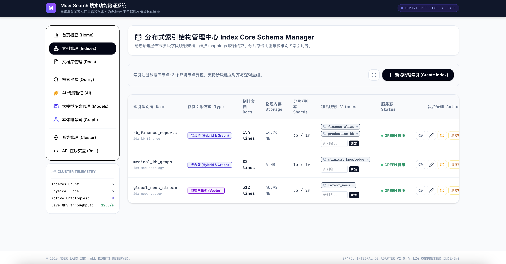
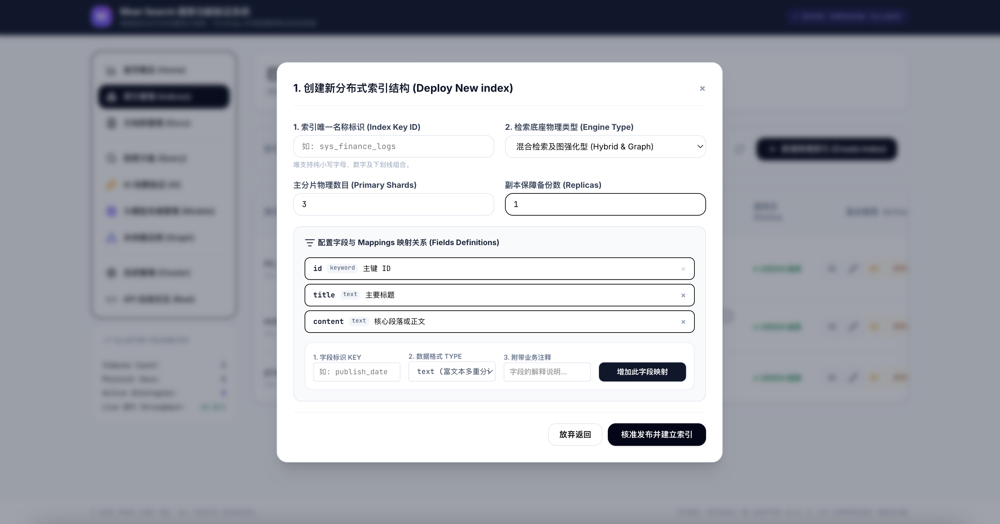

### 文档库管理

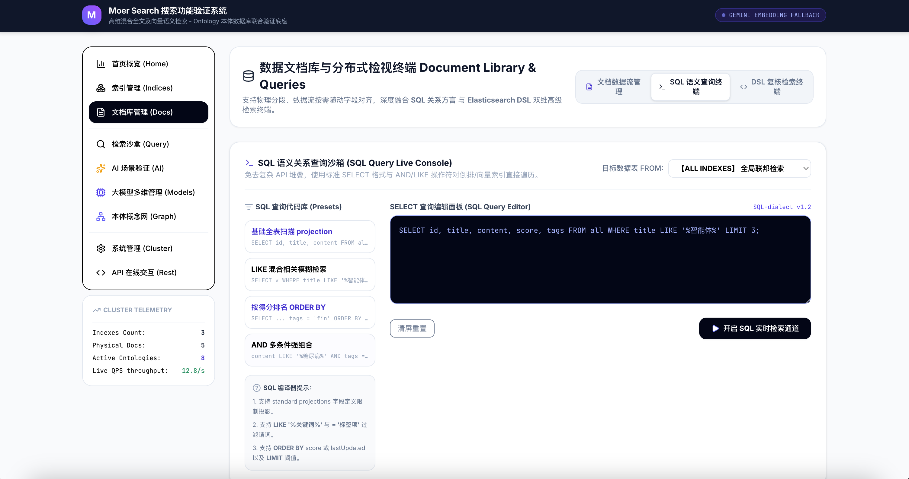
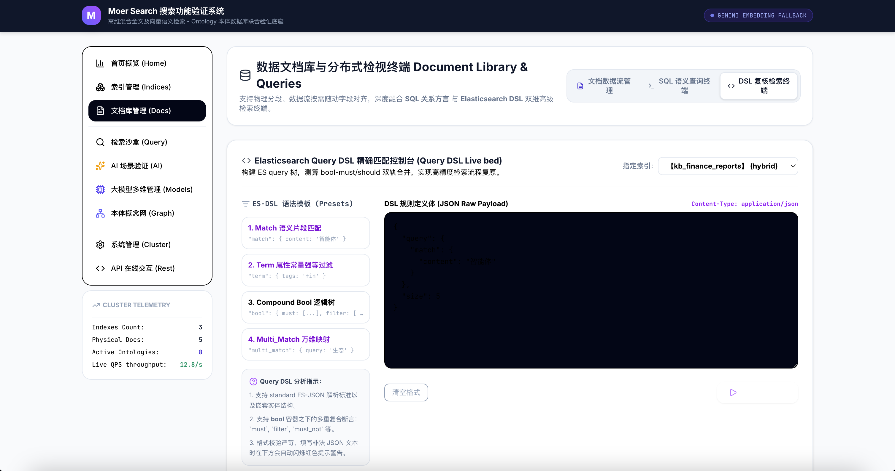

### 检索沙盒


### AI场景验证
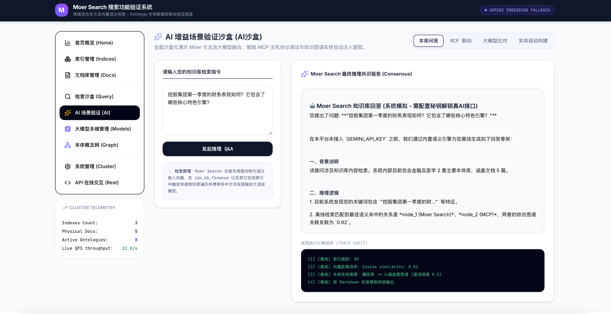


### 大模型多维管理
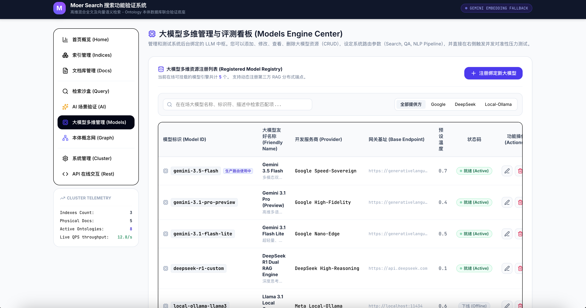
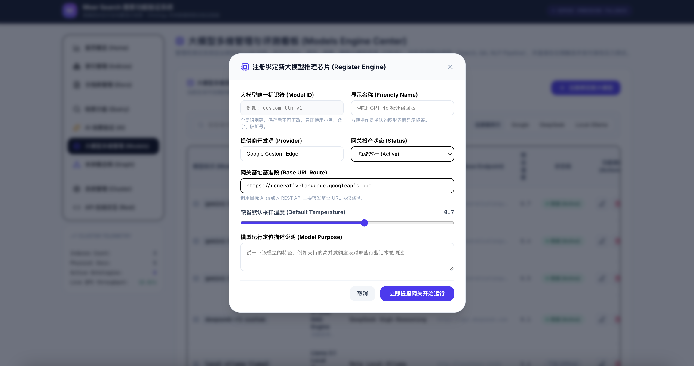

### 本体概念网
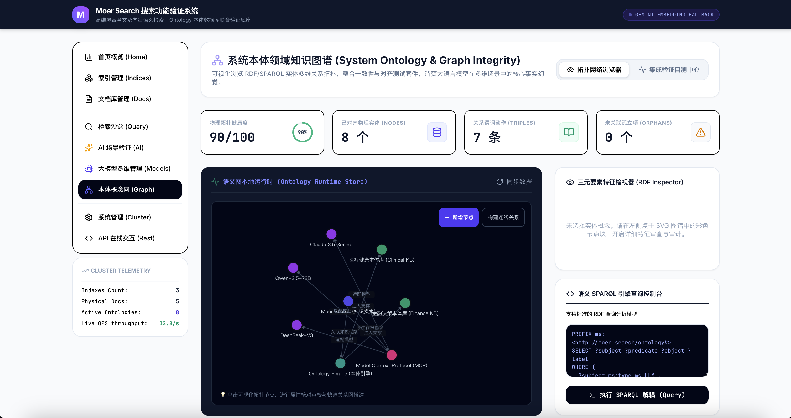
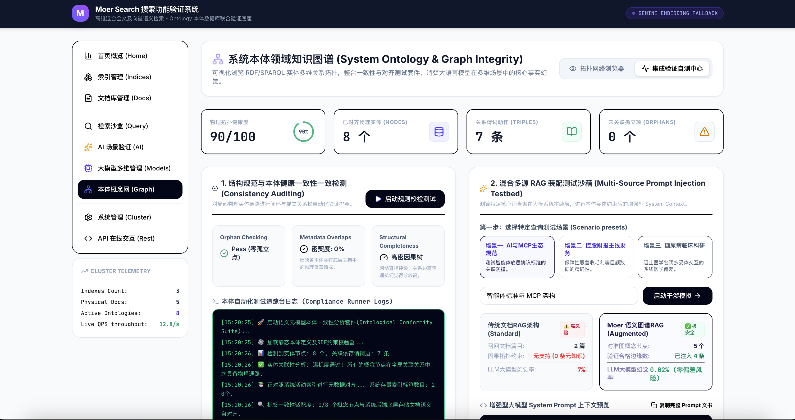

### 系统管理
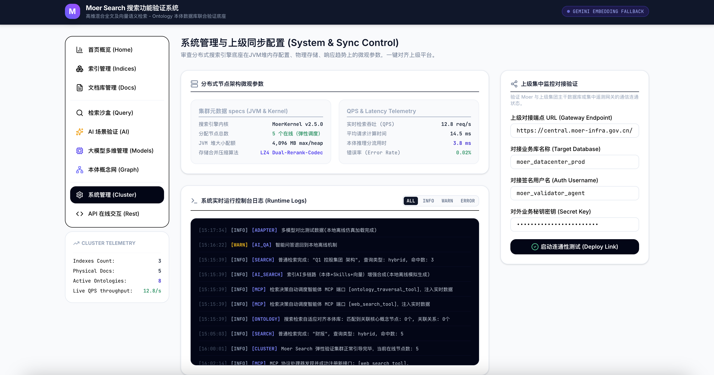

### API在线交互
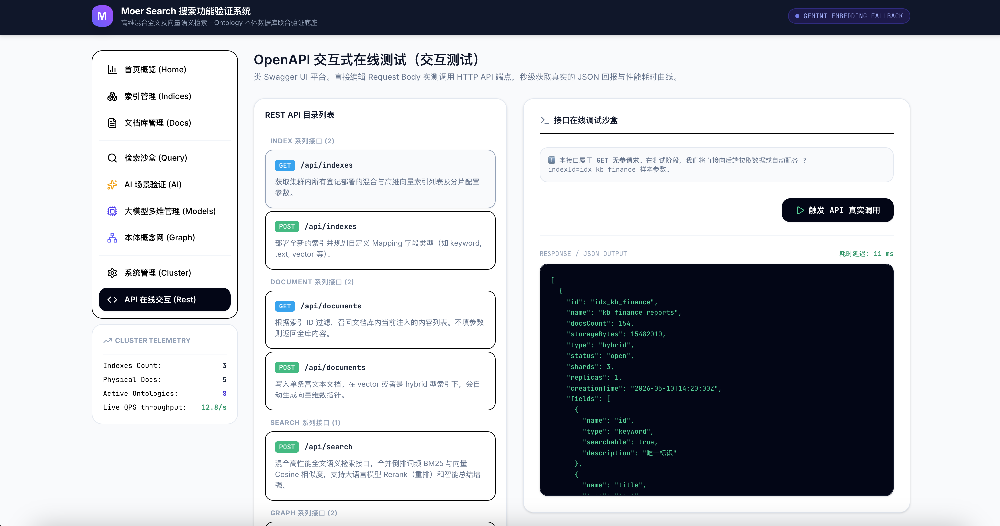

---

## 🛠️ 开发指南

### 项目结构

```
moer-search-web/
├── src/
│   ├── components/          # UI组件
│   │   ├── DashboardView.tsx
│   │   ├── IndexMgrView.tsx
│   │   ├── DocumentMgrView.tsx
│   │   ├── SearchValidatorView.tsx
│   │   ├── AiAbilitiesView.tsx
│   │   ├── ModelConfigView.tsx
│   │   ├── OntologyView.tsx
│   │   ├── SystemView.tsx
│   │   └── ApiDocsView.tsx
│   ├── App.tsx              # 主应用组件
│   ├── main.tsx             # 入口文件
│   ├── index.css            # 全局样式
│   └── types.ts             # 类型定义
├── server.ts               # 后端服务
├── index.html              # HTML模板
├── package.json            # 项目配置
├── vite.config.ts          # Vite配置
├── tsconfig.json           # TypeScript配置
└── .env.example           # 环境变量示例
```

### 开发命令

| 命令 | 描述 |
|------|------|
| `npm run dev` | 启动开发服务器 |
| `npm run build` | 构建生产版本 |
| `npm run start` | 启动生产服务器 |
| `npm run lint` | 类型检查 |
| `npm run clean` | 清理构建产物 |

### 代码规范

- 使用 TypeScript 严格模式
- 遵循 ESLint 规则
- 使用 TailwindCSS 4.x 零配置模式
- 组件命名采用 PascalCase
- 文件命名采用 kebab-case

---

## 📜 许可证

Copyright 2026 Moer Labs Inc.

Licensed under the Apache License, Version 2.0 (the "License");
you may not use this file except in compliance with the License.
You may obtain a copy of the License at

    http://www.apache.org/licenses/LICENSE-2.0

Unless required by applicable law or agreed to in writing, software
distributed under the License is distributed on an "AS IS" BASIS,
WITHOUT WARRANTIES OR CONDITIONS OF ANY KIND, either express or implied.
See the License for the specific language governing permissions and
limitations under the License.

---

## 🤝 贡献

欢迎提交 Issue 和 Pull Request！

---

**Moer Search** - 让搜索更智能 🚀

